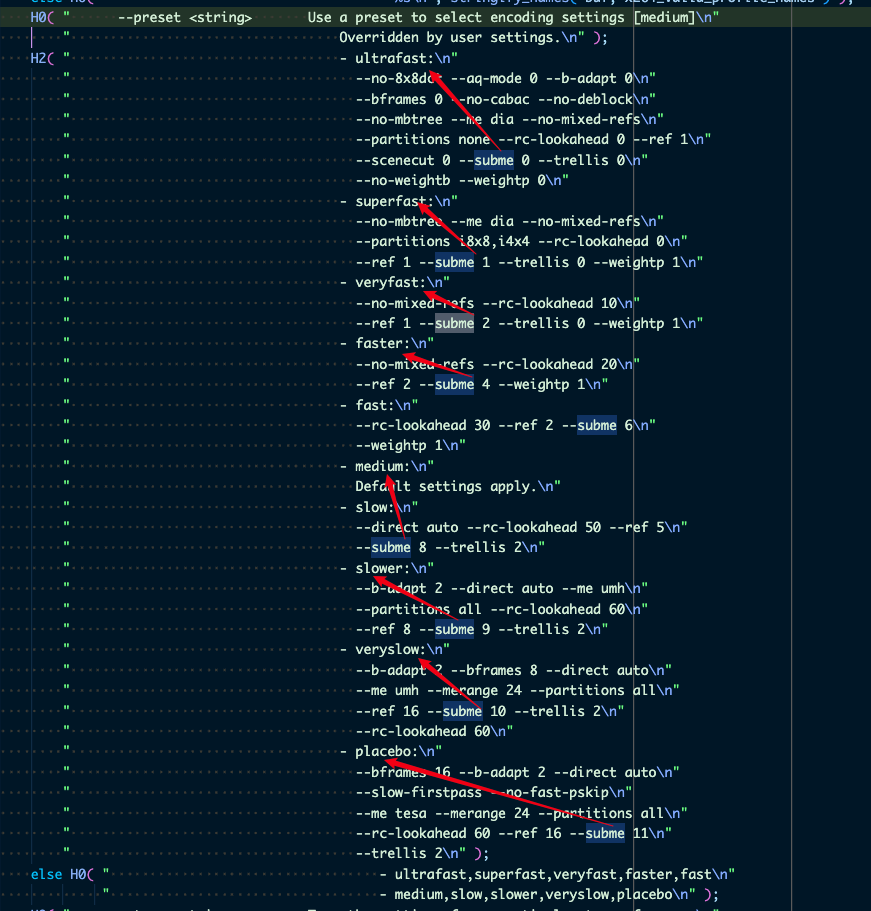

## 整体流程

弄清整体流程很重要

- 读取
- lookahead
- 宏块分析
- 宏块编码（rdo 优化）
- 熵编码
- 码率控制
- 执行下一个宏块

## lookahead 阶段做了什么事情

1. 帧类型，IBP
2. 每个宏块的类型和运动矢量
3. 帧内编码和帧间编码(同时给出了mv估计 和 基本参考关系 )的cost值
4. 编码顺序

lookahead_threads 会初始化 lookahead 专用的线程池，在需要并行的时候，分发线程去处理

lookahead 阶段，已经有运动搜索 x264_me_search

调用路径：x264_slicetype_analyse > macroblock_tree > slicetype_frame_cost > slicetype_slice_cost > slicetype_mb_cost > x264_me_search
lookahead 期间，macroblock 已经分析好了，记录了遗传代价(macroblock_tree_propagate)和继承率()

## x264_macroblock_analyse

宏块分析，发生在 lookahead 之后

slice_write -> x264_macroblock_analyse -> mb_analyse_init -> 等待前面的帧完成，等待前面的行完成

初始的 qp 是如何计算的呢？

大体过程


```c
void x264_macroblock_analyse(x264_t *)
{
    h->mb.i_qp = x264_ratecontrol_mb_qp(h); //get QP of the MB
    ...
    x264_mb_analyse_init(h, &analysis, h->mb.i_qp);

    if(h->sh.i_type == SLICE_TYPE_I)
    {
        x264_mb_analyse_intra(h, &analysis, CONST_MAX);
    }
    else if(h->sh.i_type == SLICE_TYPE_P)
    {
        x264_macroblock_probe_pskip(h);

        x264_mb_analyse_inter_p16x16(h, &analysis);

        x264_mb_analyse_inter_p8x8(h, &analysis);

        x264_mb_analyse_inter_p4x4(h, &analysis, i);

        x264_mb_analyse_inter_p8x4(h, &analysis, i);

        x264_mb_analyse_inter_p4x8(h, &analysis, i);

        x264_mb_analyse_inter_p16x8(h, &analysis, i_cost);

        x264_mb_analyse_inter_p8x16(h, &analysis, i_cost);

        x264_me_refine_qpel(h, &analysis.xxxx);
    }
    else if(h->sh.i_type == SLICE_TYPE_B)
    {
        x264_mb_analyse_inter_b16x16(h, &analysis);
        x264_mb_analyse_inter_b8x8( h, &analysis );
        x264_mb_analyse_inter_b16x8( h, &analysis );
    }
}
```

文字描述：

    如果当前是I Slice, 调用x264_mb_analyse_intra()进行Intra宏块的帧内预测模式分析。
    如果当前是P Slice, 则进行下面流程的分析：
    a. 调用x264_macroblock_probe_pskip()分析是否为skip宏块，如果是skip宏块，则不再进行下面分析。
    b. 调用x264_mb_analyse_inter_p16x16()分析P16x16帧间预测的代价。
    c. 调用x264_mb_analyse_inter_p8x8分析P8x8帧间预测的代价。
    d. 如果 P8x8 代价值小于 P16x16，则依次对 4 个 8x8 的子宏块分割进行判断：
       * 调用x264_mb_analyse_inter_p4x4()分析 P4x4 帧间预测的代价。
       * 如果P4x4代价值小于P8x8，则调用x264_mb_analyse_inter_p8x4()和x264_mb_analyse_inter_p4x8()分析P8x4和P4x8帧间预测的代价。
    e. 如果P8x8代价值小于P16x16,调用x264_mb_analyse_inter_p16x8()和x264_mb_analyse_inter_p8x16()分析P16x8和P8x16帧间预测的代价。
    f. 此外，还要调用x264_mb_analyse_intra()，检查当前宏块作为 Intra 宏块编码的代价是否小于作为 P 宏块编码的代价。

简单总结过程：

- 帧模式决策
  - 帧内预测
  - Intra16x16 预测模式分析
  - Intra4x4 预测模式分析
- 帧间预测
  - 运动补偿块
  - 运动矢量
  - MV 预测

[参考](http://lazybing.github.io/blog/2017/11/13/x264-macroblock-analyse/#section)

注意，x264_macroblock_analyse 也进行了 rdo 分析

## rdo 过程

翻译：码率-失真，优化

平衡码率压缩和效果

rdo 不是在 lookahead 阶段，而是之后

slices_write i_threads
1. x264_encoder_encode > threaded_slices_write > slices_write -> slice_write > x264_macroblock_analyse -> mb_analyse_qp_rd
2. x264_encoder_encode > slices_write -> slice_write > x264_macroblock_analyse -> mb_analyse_qp_rd

mbrd == 3，才是会启用 mb_analyse_qp_rd，mb_analyse_qp_rd 是 rdo 的核心计算过程。

## mbrd

应该是 mb rdo 的意思

根据编码参数，最终汇聚到 123 三个值

/* mbrd == 1 -> RD mode decision */

会评估不同的预测模式，并选择最佳的模式来最小化编码的比特率和失真度。

/* mbrd == 2 -> RD refinement */

更新会对之前选择的预测模式进行进一步的细化和优化，以进一步减小比特率和失真度。RD细化通常在非关键帧（P帧和B帧）上进行，以提高编码效率。

/* mbrd == 3 -> QPRD */

会根据不同的量化参数选择最佳的预测模式。量化参数用于控制编码器对图像数据的压缩程度，不同的量化参数会导致不同的比特率和失真度。QPRD模式可以在编码过程中动态地调整量化参数，以平衡比特率和失真度。

可以看到 mbrd 越大，rdo 优化做的越精细，计算量也就越大，是一个权衡，这也是计算消耗和压缩比之间的权衡，也给场景优化留空间。

## rdo.c 的调用关系
[这里](https://blog.csdn.net/gaussrieman123/article/details/78257078?spm=1001.2101.3001.6650.3&utm_medium=distribute.pc_relevant.none-task-blog-2%7Edefault%7ECTRLIST%7ERate-3-78257078-blog-117930880.235%5Ev38%5Epc_relevant_anti_t3_base&depth_1-utm_source=distribute.pc_relevant.none-task-blog-2%7Edefault%7ECTRLIST%7ERate-3-78257078-blog-117930880.235%5Ev38%5Epc_relevant_anti_t3_base&utm_relevant_index=6)

x264_encoder_encode 里会投喂数据给 lookahead 线程，并尝试从 lookahead 数据队列里取分析好的帧数据，取到了继续下面的编码操作；没有取到，直接返回，需要继续投喂。

## 码率控制

码率控制为什么在 rdo 之后，这么后面了。应该不是，rc 在 encode 全过程都有参与，至少记录一些参数，方便后续的控制

x264_ratecontrol_mb 这里只更新 vbv 相关信息，在处理下一个宏块的时候可以用到，应该使用类似漏水通的原理

## 帧并行体现在哪里

slices_write 逐行逐个宏块处理的，调用会分配不同的线程，x264_encoder_encode 函数开始时，会切换 h264 线程 context。

## slice_write 处理流程

    // 下面的信息，可以确定 slice_write 是逐个宏块处理的，并不存在帧并行的情况
    根据源代码简单梳理了 x264_slice_write() 的流程，如下所示：
    （1）调用x264_nal_start() 开始输出一个NALU。
    （2）x264_macroblock_thread_init()：初始化宏块重建像素缓存fdec_buf[]和编码像素缓存fenc_buf[]。
    （3）调用 x264_slice_header_write() 输出 Slice Header。
    （4）进入一个循环，该循环每执行一遍编码一个宏块：
    a) 每处理一行宏块，调用一次x264_fdec_filter_row() 执行滤波模块。
    b) 调用 x264_macroblock_cache_load_progressive() 将要编码的宏块的周围的宏块的信息读进来。
    c) 调用 x264_macroblock_analyse() 执行分析模块。
    d) 调用 x264_macroblock_encode() 执行宏块编码模块。
    e) 调用 x264_macroblock_write_cabac()/x264_macroblock_write_cavlc() 执行熵编码模块。
    f) 调用 x264_macroblock_cache_save() 保存当前宏块的信息。
    g) 调用 x264_ratecontrol_mb() 执行码率控制。
    h) 准备处理下一个宏块。
    （5）调用 x264_nal_end() 结束输出一个 NALU。
    ————————————————
    原文链接：https://blog.csdn.net/leixiaohua1020/article/details/45790195

## subme


## lookahead 线程处理完后，把数据放到哪里，后续的线程是怎么获取数据，继续处理的

lookahead context 有 in/out frame buffer，待处理的放到 in，已经处理完的放到 out。

和 encoder 线程交互，是通过检测 buffer 长度以及信号量等待广播的方式，来实现数据的传递。

搜索这两个信号量相关的函数，能找到线索
x264_pthread_cond_wait
x264_pthread_cond_broadcast

## me.c

me.c motion estimation 运动估计？

## preset 简单测试对比

./x264  -o test/test.yuv ./test/test_1280x720.mp4 --preset=veryslow

    lavf [info]: 1280x720p 1:1 @ 30/1 fps (vfr)
    x264 [info]: using SAR=1/1
    x264 [info]: using cpu capabilities: ARMv8 NEON
    x264 [info]: profile High, level 5.0, 4:2:0, 8-bit
    x264 [info]: frame I:4     Avg QP:16.09  size: 30602
    x264 [info]: frame P:230   Avg QP:21.39  size:  3929
    x264 [info]: frame B:667   Avg QP:16.24  size:   599
    x264 [info]: consecutive B-frames:  0.6%  2.2%  0.7% 95.9%  0.0%  0.7%  0.0%  0.0%  0.0%
    x264 [info]: mb I  I16..4: 23.8% 67.5%  8.7%
    x264 [info]: mb P  I16..4:  0.1%  0.3%  0.0%  P16..4: 13.0%  4.4%  5.0%  0.2%  0.1%    skip:76.8%
    x264 [info]: mb B  I16..4:  0.0%  0.0%  0.0%  B16..8: 14.9%  0.2%  0.0%  direct: 0.0%  skip:84.9%  L0:37.2% L1:60.5% BI: 2.4%
    x264 [info]: 8x8 transform intra:68.3% inter:51.3%
    x264 [info]: direct mvs  spatial:98.8% temporal:1.2%
    x264 [info]: coded y,uvDC,uvAC intra: 29.6% 28.0% 10.5% inter: 1.0% 1.3% 0.2%
    x264 [info]: i16 v,h,dc,p: 77%  5% 11%  7%
    x264 [info]: i8 v,h,dc,ddl,ddr,vr,hd,vl,hu: 15%  7% 42%  4%  8%  7%  6%  5%  5%
    x264 [info]: i4 v,h,dc,ddl,ddr,vr,hd,vl,hu:  8%  6% 11% 11% 15% 13% 12% 12% 14%
    x264 [info]: i8c dc,h,v,p: 72% 11% 11%  7%
    x264 [info]: Weighted P-Frames: Y:0.0% UV:0.0%
    x264 [info]: ref P L0: 69.6% 17.0%  6.6%  2.1%  1.1%  0.8%  0.7%  0.3%  0.3%  0.3%  0.2%  0.2%  0.2%  0.2%  0.3%  0.2%
    x264 [info]: ref B L0: 94.4%  3.5%  0.8%  0.4%  0.2%  0.2%  0.1%  0.1%  0.0%  0.1%  0.0%  0.0%  0.0%  0.0%  0.0%
    x264 [info]: ref B L1: 97.6%  2.4%
    x264 [info]: kb/s:379.74

    encoded 901 frames, 143.76 fps, 379.74 kb/s

./x264  -o test/test.yuv ./test/test_1280x720.mp4 --preset=veryfast

    lavf [info]: 1280x720p 1:1 @ 30/1 fps (vfr)
    x264 [info]: using SAR=1/1
    x264 [info]: using cpu capabilities: ARMv8 NEON
    x264 [info]: profile High, level 3.1, 4:2:0, 8-bit
    x264 [info]: frame I:4     Avg QP:11.86  size: 26506
    x264 [info]: frame P:227   Avg QP:21.29  size:  3111
    x264 [info]: frame B:670   Avg QP:21.38  size:   335
    x264 [info]: consecutive B-frames:  0.8%  0.2%  0.0% 99.0%
    x264 [info]: mb I  I16..4: 71.6% 13.6% 14.7%
    x264 [info]: mb P  I16..4:  0.9%  1.0%  0.0%  P16..4: 10.8%  4.7%  2.2%  0.0%  0.0%    skip:80.5%
    x264 [info]: mb B  I16..4:  0.0%  0.0%  0.0%  B16..8:  3.0%  0.5%  0.0%  direct: 0.3%  skip:96.2%  L0:31.2% L1:48.7% BI:20.1%
    x264 [info]: 8x8 transform intra:32.1% inter:30.7%
    x264 [info]: coded y,uvDC,uvAC intra: 34.1% 32.6% 5.7% inter: 0.9% 1.0% 0.0%
    x264 [info]: i16 v,h,dc,p: 69% 11% 13%  7%
    x264 [info]: i8 v,h,dc,ddl,ddr,vr,hd,vl,hu: 24%  9% 25%  3% 12% 12%  6%  5%  4%
    x264 [info]: i4 v,h,dc,ddl,ddr,vr,hd,vl,hu: 17% 17% 23%  4% 12%  6%  7%  6%  8%
    x264 [info]: i8c dc,h,v,p: 67% 11% 18%  4%
    x264 [info]: Weighted P-Frames: Y:0.0% UV:0.0%
    x264 [info]: kb/s:276.14

    encoded 901 frames, 530.61 fps, 276.14 kb/s 看 fps 快了很多


## 帧延迟的意义

一般分析的足够多的帧（上下文），一般的结果是压缩率更高，允许更多的延迟，分析就足够充分

所以编码器里面一般提供了 lookahead-threads, threads, bframes，这几个参数加起来一般得到直播里面的延迟多少帧


## 其他疑问

记录一下，后续一一解读

- 如何计算 bd_rate
- pskip bskip 宏块 https://blog.csdn.net/stpeace/article/details/8202880